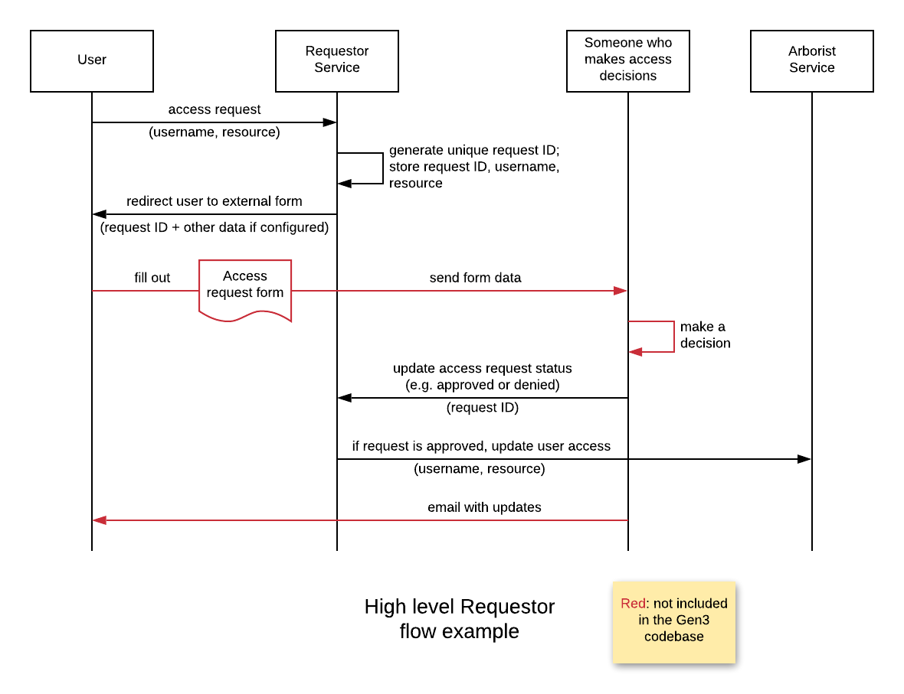

# Requestor

Requestor exposes an API to manage access requests.

The server is built with [FastAPI](https://fastapi.tiangolo.com/) and packaged with [Poetry](https://poetry.eustace.io/).

## Example flow

Requestor can be configured to return a URL so users can be redirected to external pages, such as access request forms (see example below). However, at this time there is no Gen3 UI to interact with Requestor. Forms and UIs can be external, or calls can be made directly through the API.

## Key documentation

The documentation can be browsed in the [docs](docs) folder, and key documents are linked below.

* [Detailed API Documentation](http://petstore.swagger.io/?url=https://raw.githubusercontent.com/uc-cdis/requestor/master/docs/openapi.yaml)
* [Functionality and flow](docs/functionality_and_flow.md)
* [Requestor Statuses](docs/statuses.md)
* [Local installation](docs/local_installation.md)
