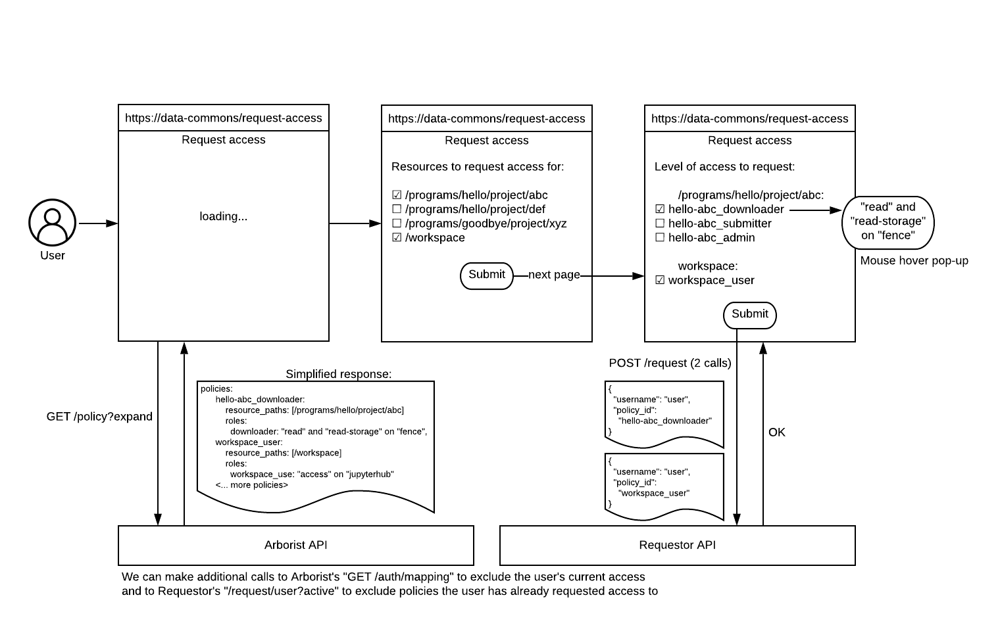

## High-level functionality

- Requestor has the ability to grant access to resources or policies as configured by the implementing entity.
- Requestor has the ability to revoke access to resources or policies as configured by the implementing entity.
- Requestor is configurable to the implementing entity’s access request workflow:
  - Unique statuses
  - Unique routing (external form or system)
- Requestor has the ability to store status information for a request, based on the workflow established.
- Requestor has the ability to display status information to the implementing entity via their external system, based on the workflow established.
- Request records are retained. However we do not retain information such as which statuses the request went through and when; only the last status.

## Example backend flow

Requestor can be configured to return a URL so users can be redirected to external pages, such as access request forms (see example below). However, at this time there is no Gen3 UI to interact with Requestor. Forms and UIs can be external, or calls can be made directly through the API.

The Requestor service API is leveraged through the use of external forms/pages or services which are put in place and managed by the implementing organization.

A user interacts with the service in the following way:
- From a Gen3 Commons, the implementing organization will expose a "Request Access" option which will be displayed to users if they are logged in and do not currently have access to the resource (Program / Project) or policy.
- The user is directed to an external form to complete an access request which should contain at a minimum:
  - User name
  - One of the following for which access is being requested:
    - policy
    - resource_paths + existing role_ids
    - resource_path[s] without a role_id (to be assigned default reader roles, currently `peregrine_reader`, `guppy_reader`, and `fence_storage_reader`)
  - Level of access
- `resource_paths` will take precedence over `resource_path` if both are present in the request.
- The service will generate a unique request ID (per user+resource or user+policy) and store this along with the username and resource or policy ID.
- The service will send this data to the capturing system/process for review by appropriate administrative staff for the Gen3 Commons in question.
- _The User may or may not receive confirmation of their request being received - this would be handled by the capturing system/process._
- Reviewers / Administrators will Approve or Deny the request.
  - Upon approval, the service will update access to the appropriate resource or policy for the user and update the status of the record/request.
  - Upon denial, the service will update the status of the record/request.
- _The User may or may not receive confirmation of their request decision - this would be handled by the capturing system/process._

## Example User Interface

Requestor can be leveraged to create a "Request Access" page such as the one below.

