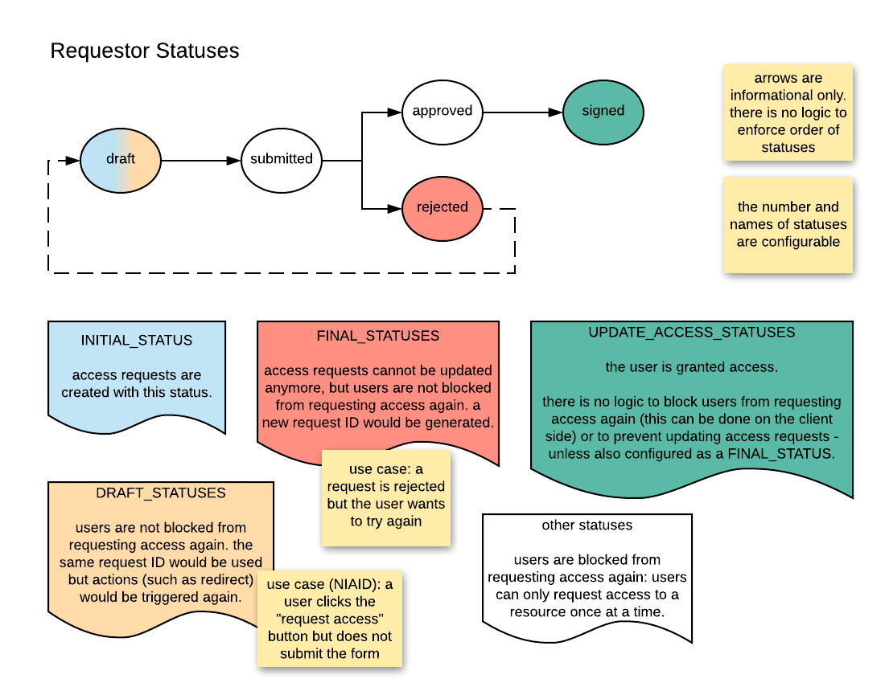

# Requestor Statuses



## Example Configuration

```
ALLOWED_REQUEST_STATUSES:
  - DRAFT
  - SUBMITTED
  - APPROVED
  - SIGNED
  - REJECTED

# status of new requests when no status is specified by
# the user
DEFAULT_INITIAL_STATUS: DRAFT

# users are not blocked from requesting access again. the same request ID
# would be used but actions (such as redirect) would be triggered again.
DRAFT_STATUSES:
  - DRAFT

# automatically update the user's access. there is no logic to block users
# from requesting access again (this can be done on the client side) or to
# prevent updating access requests - unless also configured as a FINAL_STATUS.
UPDATE_ACCESS_STATUSES:
  - SIGNED

# access requests cannot be updated anymore, but users are not blocked
# from requesting access again. a new request ID would be generated.
FINAL_STATUSES:
  - REJECTED
```
